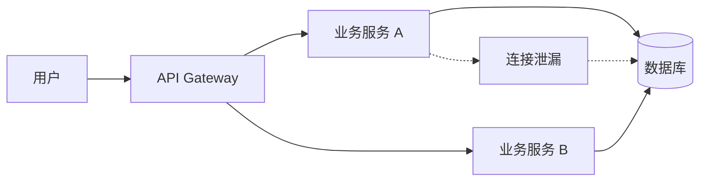

# [事故名称] 事故复盘报告

> 一句话概括这次事故的核心问题。

## 📖 阅读指南

### 新手阅读路径
1. **第一步**：阅读 [事故概述](#事故概述)，快速了解发生了什么
2. **第二步**：查看 [时间线](#时间线)，了解事故的完整过程
3. **第三步**：阅读 [根因分析](#根因分析)，理解为什么会发生
4. **第四步**：查看 [改进措施](#改进措施)，知道以后怎么避免

### 不同角色速查路径
- 工程师 → 直接看 [技术细节](#技术细节) 和 [改进措施](#改进措施)
- 团队负责人 → 直接看 [影响评估](#影响评估) 和 [经验教训](#经验教训)
- SRE/运维 → 直接看 [监控告警](#监控告警) 和 [改进措施](#改进措施)
- 产品经理 → 直接看 [影响评估](#影响评估) 和 [用户影响](#用户影响)

### AI 使用提示
> ⚠️ **给 AI 的说明**：使用本文档时，请注意以下要点：
> - 根因分析要找到**根本原因**，不要停留在表面现象
> - 改进措施必须是**可执行**的，有明确的责任人和验收标准
> - 不要把责任归咎于个人，专注于系统和流程的改进
> - 参考 [类似事故](#类似事故) 避免重复分析已知问题

---

## 元信息

**简要说明：** 这里记录了事故的基本信息，比如编号、级别、发生时间等，方便大家快速了解事故概况。

| 字段 | 内容 |
|------|------|
| 事故编号 | INC-2026-0427-001 |
| 事故级别 | P0 / P1 / P2 |
| 发现时间 | 2026-04-27 14:30:00 |
| 恢复时间 | 2026-04-27 15:45:00 |
| 总时长 | 1 小时 15 分钟 |
| 负责人 | @owner |
| 复盘日期 | 2026-05-01 |

---

## 事故概述

### 事故摘要

简要描述事故的起因、影响和恢复过程。3-5句话。

### 影响评估

**简要说明：** 这里记录了事故对服务、用户、业务等方面造成的影响，帮助评估严重程度。

| 维度 | 影响 |
|------|------|
| 服务影响 | API 成功率从 99.9% 降至 60%，持续 1 小时 |
| 用户影响 | 约 10,000 用户受到影响 |
| 业务影响 | 损失订单约 500 单 |
| 收入影响 | 预估损失约 ¥50,000 |
| 品牌影响 | 社交媒体出现负面反馈 |

### 必须掌握的核心点 ⭐

**简要说明：** 这里总结了本次事故最关键的要点，看这几点就明白事故的核心问题。

| 要点 | 说明 |
|------|------|
| 根本原因 | 这次事故的根本原因是什么 |
| 直接原因 | 触发事故的导火索是什么 |
| 主要教训 | 从这次事故中学到什么 |
| 核心改进 | 最关键的改进措施是什么 |

---

## 时间线

### 事故发展过程

**简要说明：** 这里按时间顺序记录了事故从发生到恢复的完整过程，像看故事一样了解整个经过。

| 时间 | 事件 | 操作人 | 影响 |
|------|------|--------|------|
| 14:25 | 开发人员 A 部署了新版本 v2.3.1 | @dev-a | 开始 |
| 14:28 | 监控系统检测到错误率上升 | - | 告警触发 |
| 14:30 | 值班人员收到告警 | @oncall | 开始响应 |
| 14:35 | 确认是新版本导致，开始回滚 | @dev-a | 回滚开始 |
| 14:42 | 回滚完成，但问题仍存在 | @dev-a | 部分恢复 |
| 14:50 | 发现是数据库连接池耗尽 | @dev-a, @dba | 根因发现 |
| 15:10 | 重启数据库连接池 | @dba | 恢复中 |
| 15:30 | 监控显示服务恢复正常 | @oncall | 确认恢复 |
| 15:45 | 发送事故通知 | @pm | 事后处理 |

### 关键时间节点

```mermaid
gantt
    title 事故时间线
    dateFormat X
    axisFormat %H:%M

    section 故障期
    问题存在      :0, 90
    section 响应期
    发现告警      :crit, 3, 5
    开始调查      :5, 10
    执行回滚      :10, 17
    section 恢复期
    根因定位      :17, 25
    实施修复      :25, 40
    确认恢复      :40, 55
```



---

## 根因分析

### 直接原因

导致事故发生的直接触发因素。

**描述**：数据库连接池配置为最大 100 连接，但新版本代码中存在连接泄漏，导致连接逐渐耗尽。

### 根本原因

深入分析为什么会发生这个问题（5 WHY 分析）。

```
问题：为什么连接池耗尽？
原因1：为什么连接没有释放？→ 代码中 finally 块未正确关闭数据库连接

原因2：为什么 finally 块没有正确关闭？→ 重构时遗漏了连接关闭逻辑

原因3：为什么遗漏了？→ 代码审查时没有检查资源释放

原因4：为什么审查时没发现？→ 审查清单缺少资源管理检查项

原因5：为什么没有检查项？→ 团队没有建立资源管理的最佳实践文档
```

### 贡献因素

导致事故加剧或影响扩大的其他因素。

**简要说明：** 这里分析了让事故变得更严重或影响更大的其他原因，不只是直接原因。

| 因素 | 描述 | 影响 |
|------|------|------|
| 监控缺失 | 没有监控数据库连接池使用率 | 延长了发现时间 |
| 变更窗口 | 在高峰期进行了重大变更 | 放大了影响范围 |
| 回滚方案 | 回滚脚本执行慢（10分钟） | 延长了恢复时间 |

---

## 监控告警

### 告警记录

**简要说明：** 这里记录了监控系统发出的告警信息，包括什么时候报的警、持续了多久。

| 告警 | 触发时间 | 阈值 | 持续时间 |
|------|----------|------|----------|
| API 错误率 > 1% | 14:28 | > 1% | 77 分钟 |
| 响应时间 P99 > 1s | 14:29 | > 1s | 76 分钟 |
| 数据库连接等待超时 | 14:30 | > 100ms | 75 分钟 |

### 问题

- ❌ 没有数据库连接池使用率监控
- ❌ 没有慢查询监控
- ❌ 告警没有关联到具体服务

---

## 技术细节

### 涉及的系统



### 相关代码

**问题代码**（已修复）：

```javascript
// 问题：异常时未关闭连接
async function query(sql) {
    const connection = await pool.getConnection();
    try {
        return await connection.query(sql);
    } catch (error) {
        throw error;
    }
    // 缺少 finally { connection.release(); }
}
```

**修复后代码**：

```javascript
// 修复：正确释放连接
async function query(sql) {
    const connection = await pool.getConnection();
    try {
        return await connection.query(sql);
    } finally {
        connection.release(); // 始终释放
    }
}
```

---

## 改进措施

### 短期措施（1 周内）

**简要说明：** 这里列出了1周内要完成的紧急改进措施，快速修复最紧迫的问题。

| 措施 | 负责人 | 状态 | 验收标准 |
|------|--------|------|----------|
| 修复连接泄漏代码 | @dev-a | ✅ 已完成 | 通过代码审查 |
| 紧急添加连接池监控 | @sre | ✅ 已完成 | 告警已配置 |
| 添加连接池健康检查 | @dev-a | ✅ 已完成 | 接口已上线 |

### 中期措施（1 个月内）

**简要说明：** 这里列出了1个月内要完成的改进措施，解决系统性的中间问题。

| 措施 | 负责人 | 状态 | 验收标准 |
|------|--------|------|----------|
| 建立代码审查资源管理清单 | @tech-lead | 进行中 | 清单已制定 |
| 添加变更前的连接池测试 | @qa | 待开始 | 测试用例已添加 |
| 优化回滚脚本（目标 2 分钟） | @dev-ops | 待开始 | 回滚时间 < 2 分钟 |

### 长期措施（3 个月内）

**简要说明：** 这里列出了3个月内要完成的长期改进措施，从根本上避免类似问题再次发生。

| 措施 | 负责人 | 状态 | 验收标准 |
|------|--------|------|----------|
| 建立资源管理最佳实践文档 | @tech-lead | 待开始 | 文档已培训 |
| 引入数据库连接池熔断机制 | @dev-a | 待开始 | 熔断已实现 |
| 实施渐进式发布策略 | @dev-ops | 待开始 | 灰度发布已配置 |

---

## 经验教训

### 做得好 👍

1. **快速响应**：值班人员在 2 分钟内响应告警
2. **及时升级**：当自助解决不了时，及时升级到 DBA 团队
3. **透明沟通**：在 Slack 实时同步进展，保持信息透明

### 需要改进 👎

1. **变更窗口**：重大变更应在低峰期执行
2. **监控覆盖**：关键指标应有完整的监控和告警
3. **回滚方案**：需要预先演练回滚流程，确保可以快速回滚

### 行动项汇总

**简要说明：** 这里汇总了所有需要执行的行动项，方便跟踪哪些事情还没做完。

| 行动项 | 类型 | 负责人 | 截止日期 |
|--------|------|--------|----------|
| 建立代码审查清单 | 流程 | @tech-lead | 2026-05-15 |
| 配置连接池监控 | 监控 | @sre | 2026-05-05 |
| 优化回滚脚本 | 自动化 | @dev-ops | 2026-05-20 |

---

## 类似事故

**简要说明：** 这里列出了以前发生过的类似事故，可以参考之前的处理经验，避免重复踩坑。

| 事故编号 | 相似点 | 上次改进 |
|----------|--------|----------|
| INC-2026-0315-003 | 同样的数据库连接池问题 | 已添加连接超时监控，但未添加使用率监控 |
| INC-2025-1201-001 | 代码变更导致故障 | 已建立回滚机制，但回滚时间过长 |

---

## 附录

### 相关文档

**简要说明：** 这里提供了与本次事故相关的文档链接，方便查看监控、日志等详细信息。

| 文档 | 链接 |
|------|------|
| 监控大盘 | [Grafana](#) |
| 日志查询 | [Kibana](#) |
| 事故群记录 | [link](#) |

### 参与者

**简要说明：** 这里记录了参与事故处理和复盘的人员名单，以及每个人做了什么贡献。

| 姓名 | 角色 | 贡献 |
|------|------|------|
| @oncall | 值班工程师 | 发现并响应 |
| @dev-a | 开发工程师 | 回滚和修复 |
| @dba | 数据库工程师 | 协助定位根因 |
| @sre | SRE 工程师 | 监控和问题跟进 |

---

## 变更日志

**简要说明：** 这里记录了这份文档的修改历史，方便知道什么时候更新了什么内容。

| 版本 | 日期 | 变更内容 | 作者 |
|------|------|----------|------|
| 1.0 | 2026-05-01 | 初始版本 | @owner |

---

## 许可证

[MIT License](LICENSE) - Copyright (c) 2026
