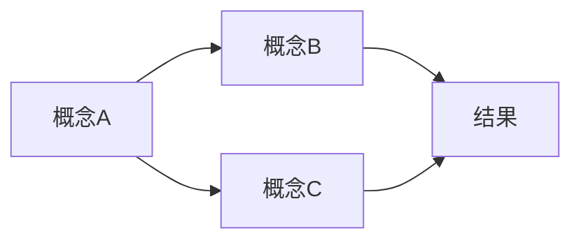
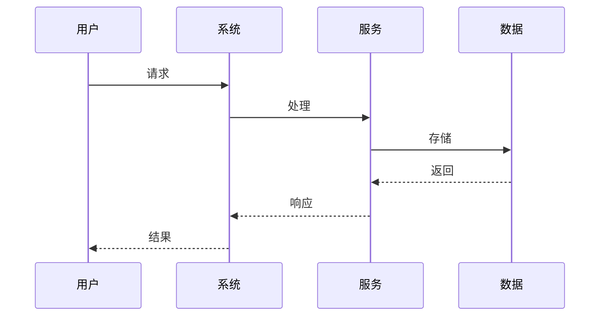
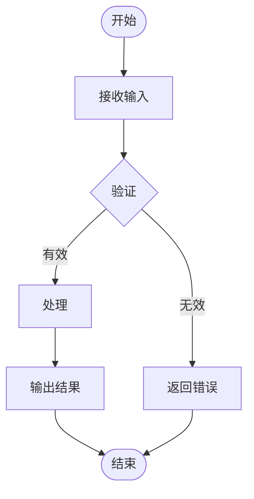

# 文档标题

> 一句话说清楚这个知识领域是什么。

---

## 📑 目录导航

- [📖 阅读指南](#-阅读指南)
- [🎯 简介](#-简介)
- [💡 核心概念](#-核心概念)
- [⚙️ 核心原理](#️-核心原理)
- [📚 理论知识](#-理论知识)
- [🔧 功能特性](#-功能特性)
- [💻 示例代码](#-示例代码)
- [⭐ 最佳实践](#-最佳实践)
- [❓ 常见问题](#-常见问题)
- [🚀 进阶主题](#-进阶主题)
- [📝 变更日志](#-变更日志)

---

## 📖 阅读指南

### 新手入门路径
1. **第一步**：阅读 [简介](#简介)，了解这个知识领域的范围和目标
2. **第二步**：学习 [核心概念](#核心概念)，掌握关键术语和基本定义
3. **第三步**：理解 [核心原理](#核心原理)，建立理论框架
4. **第四步**：参考 [最佳实践](#最佳实践)，了解如何正确应用
5. **第五步**：通过 [示例代码](#示例代码) 加深理解

### 老手速查路径
- 查概念 → 直接看 [关键术语表](#关键术语)
- 查原理 → 直接看 [工作机制](#工作机制)
- 查规范 → 直接看 [最佳实践](#最佳实践)
- 查问题 → 直接看 [常见问题](#常见问题)

### AI 使用提示
> ⚠️ **给 AI 的说明**：使用本文档时，请注意以下要点：
> - 本文档侧重**概念和原理**，不是操作手册，不要生成具体的安装部署命令
> - 涉及架构决策时，必须参考 [设计原则](#设计原则) 和 [架构模式](#架构模式)
> - 示例代码仅用于说明原理，生产环境需要额外考虑错误处理和性能优化
> - 注意区分 "应该怎么做"（最佳实践）和 "可以怎么做"（功能特性）
> - 涉及版本对比时，以 [功能矩阵](#功能矩阵) 为准

---

## 🎯 简介

### 概述

简要说明本文档涵盖的核心知识和学习目标。2-3句话即可。

### 涵盖内容

- **内容1**：描述内容1
- **内容2**：描述内容2

### 适用读者

- **初学者**：希望系统学习该领域的基础知识
- **有经验的开发者**：需要查阅特定概念或最佳实践
- **架构师**：评估技术选型和设计决策
- **AI 助手**：需要准确理解领域知识以生成正确代码

### 必须掌握的核心点 ⭐

**简要说明：** 学习本知识领域需要重点掌握的内容，按重要性排序。

| 要点 | 重要性 | 说明 |
|------|--------|------|
| 关键术语 | 高 | 准确理解所有专业术语的定义 |
| 设计原则 | 高 | 指导所有技术决策的根本原则 |
| 架构模式 | 中 | 不同场景下的推荐架构方案 |
| 最佳实践 | 高 | 避免常见错误的经验总结 |
| 版本差异 | 中 | 不同版本间的功能变化和兼容性 |

---

## 💡 核心概念

### 关键术语

**简要说明：** 本领域的专业术语定义和相关概念，术语是理解领域知识的基础。

| 术语 | 英文 | 定义 | 相关概念 |
|------|------|------|----------|
| 术语1 | Term1 | 术语1的定义 | [概念A](#), [概念B](#) |
| 术语2 | Term2 | 术语2的定义 | [概念C](#) |
| 术语3 | Term3 | 术语3的定义 | [概念A](#), [概念D](#) |

### 概念关系



### 概念层次

```
核心概念
├── 基础概念
│   ├── 概念1
│   └── 概念2
├── 进阶概念
│   ├── 概念3
│   └── 概念4
└── 专家概念
    ├── 概念5
    └── 概念6
```

---

## ⚙️ 核心原理

### 设计原则

1. **单一职责**：每个模块只做一件事，降低耦合度
2. **开闭原则**：对扩展开放，对修改关闭
3. **依赖倒置**：依赖抽象而非具体实现
4. **里氏替换**：子类可以替换父类而不影响程序正确性

### 架构模式

**简要说明：** 常见的架构模式及其适用场景，每种模式都有优缺点，需要根据实际情况选择。

| 模式 | 适用场景 | 优点 | 缺点 |
|------|----------|------|------|
| MVC | Web 应用 | 职责分离清晰 | 复杂业务下 Controller 臃肿 |
| 微服务 | 大型分布式系统 | 独立部署扩展 | 运维复杂度高 |
| 事件驱动 | 实时应用 | 松耦合 | 调试困难 |
| CQRS | 复杂业务逻辑 | 读写分离优化 | 数据一致性挑战 |

### 工作机制



---

## 📚 理论知识

### 背景

介绍该领域的历史背景和发展历程。

### 核心概念详解

**简要说明：** 重要概念的详细解释，包括使用场景和注意事项。

| 概念 | 解释 | 使用场景 | 注意事项 |
|------|------|----------|----------|
| 概念A | A的解释 | 何时使用A | 使用A时的常见陷阱 |
| 概念B | B的解释 | 何时使用B | 使用B时的常见陷阱 |
| 概念C | C的解释 | 何时使用C | 使用C时的常见陷阱 |

### 工作流程



---

## 🔧 功能特性

### 核心功能

#### 功能1 【重要】

- **功能描述**：详细说明功能1的作用
- **使用方式**：如何使用这个功能
- **适用场景**：什么时候应该用这个功能
- **参数说明**：
  - `param1`：参数1的说明（类型：string，必需）
  - `param2`：参数2的说明（类型：number，可选，默认：0）
- **注意事项**：使用时的特别警告或限制

#### 功能2 【新增】

- **功能描述**：详细说明功能2的作用
- **版本引入**：v2.0
- **与旧版差异**：和之前版本的对比

### 功能矩阵

**简要说明：** 功能在各版本中的支持情况，包括新增、废弃和演变。

| 功能 | v1.0 | v2.0 | v3.0 | 说明 |
|------|------|------|------|------|
| 功能A | ✅ | ✅ | ✅ | 基础功能 |
| 功能B | ❌ | ✅ | ✅ | v2.0 新增 |
| 功能C | ❌ | ❌ | ✅ | v3.0 新增 |
| 功能D | ✅ | ❌ | ❌ | v2.0 已废弃 |

---

## 💻 示例代码

### 入门示例

```javascript
// 基础用法示例
const { Client } = require('package-name');

async function demo() {
  const client = new Client({ apiKey: 'your-key' });
  const created = await client.create({ name: 'test' });
  console.log('创建:', created.id);
  const resource = await client.get(created.id);
  await client.update(created.id, { name: 'updated' });
  await client.delete(created.id);
}

demo().catch(console.error);
```

### 完整工作流

```javascript
class Workflow {
  constructor(client) {
    this.client = client;
  }
  
  async run(inputData) {
    console.log('验证输入');
    this.validate(inputData);
    
    console.log('预处理');
    const processed = await this.preprocess(inputData);
    
    console.log('执行核心逻辑');
    const result = await this.process(processed);
    
    console.log('后处理');
    return this.postprocess(result);
  }
  
  validate(data) {
    if (!data.required) {
      throw new Error('缺少必需字段');
    }
  }
  
  async preprocess(data) {
    return { ...data, processed: true };
  }
  
  async process(data) {
    return await this.client.doSomething(data);
  }
  
  async postprocess(result) {
    return { success: true, data: result };
  }
}
```

### 错误处理模式

```javascript
try {
  const result = await client.doSomething();
} catch (error) {
  if (error.code === 1002) {
    console.error('认证失败');
  } else if (error.code === 3001) {
    console.error('服务器错误，重试');
  }
}
```

---

## ⭐ 最佳实践

### 安全建议

1. **保护敏感信息**：使用环境变量，不要硬编码
2. **输入验证**：验证所有用户输入
3. **日志脱敏**：

```javascript
function sanitize(data) {
  return { ...data, apiKey: '***' };
}
```

### 性能优化

**简要说明：** 常用的性能优化手段及适用场景，方便根据实际情况选择。

| 优化项 | 说明 | 预期效果 | 适用场景 |
|--------|------|----------|----------|
| 连接复用 | 使用 keep-alive | 减少连接建立时间 | 高频调用 |
| 请求批量 | 合并小请求 | 减少网络开销 | 大量小数据 |
| 缓存结果 | 合理缓存热点数据 | 减少 API 调用 | 读多写少 |
| 并发控制 | 限制并发数量 | 避免触发限流 | 批量处理 |

### 开发环境

1. **使用环境变量管理敏感信息**
   ```bash
   API_KEY=your-key-here
   BASE_URL=https://api.example.com
   ```

2. **使用配置文件区分环境**
   ```
   config/
   ├── config.dev.json    # 开发环境
   ├── config.test.json   # 测试环境
   └── config.prod.json   # 生产环境
   ```

### 常见反模式 ❌

**简要说明：** 应该避免的常见错误做法及正确的替代方案。

| 反模式 | 问题 | 正确做法 |
|--------|------|----------|
| 全局状态 | 难以测试和维护 | 使用依赖注入 |
| 深层嵌套 | 代码可读性差 | 提前返回或使用函数拆分 |
| 忽略错误 | 静默失败难以调试 | 显式处理每个错误 |
| 硬编码配置 | 环境切换困难 | 使用配置文件或环境变量 |

---

## ❓ 常见问题

### Q1: 如何快速判断应该使用哪种架构模式？

**A:** 根据项目规模和复杂度选择：
- 小型项目：MVC 或简单分层
- 中型项目：模块化 + 依赖注入
- 大型项目：微服务 + 事件驱动
- 复杂查询：CQ