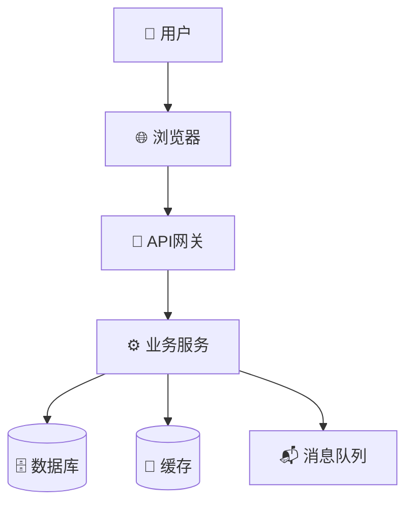
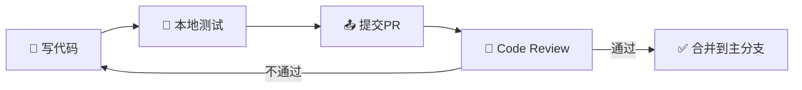

# 文档标题

> 一句话说清楚这个项目是什么。

---

## 📑 目录导航

| 章节 | 说明 | 建议阅读时间 | 推荐人群 |
|------|------|--------------|----------|
| [🎯 简介](#-简介) | 这是什么项目，能解决什么问题 | 5分钟 | 所有人 |
| [🚀 快速开始](#-快速开始) | 5分钟跑起来 | 5分钟 | 开发者 |
| [🏗️ 架构设计](#️-架构设计) | 技术架构和组件关系 | 10分钟 | 架构师 |
| [👨‍💻 开发指南](#-开发指南) | 代码规范和开发流程 | 15分钟 | 开发者 |
| [📡 API 参考](#-api-参考) | 接口调用方式 | 10分钟 | 前后端 |
| [⚙️ 配置参考](#️-配置参考) | 配置文件说明 | 5分钟 | 运维 |
| [🐛 故障排除](#-故障排除) | 常见问题解决 | 按需 | 所有人 |
| [🚀 部署指南](#-部署指南) | 如何上线部署 | 10分钟 | 运维 |
| [⭐ 最佳实践](#-最佳实践) | 安全和性能建议 | 5分钟 | 开发者 |

---

## 🎯 简介

### 这是什么？

> **通俗解释**：想象你要去一个陌生的地方旅游，这份文档就是你的"旅行攻略"——告诉你去哪里、怎么去、要注意什么。

### 概述

简要说明项目的核心定位和解决的问题。2-3句话即可。

**示例**：
> 这是一个帮助电商公司管理订单的系统。它能追踪从用户下单到商品送达的全过程，让运营人员能实时看到订单状态。

### 解决的问题

**简要说明：** 列出项目解决的主要问题和对应的用户群体。

**通俗解释**：就像超市的收银系统——它解决了"不知道卖了多少货、钱对不对"的问题。

| 问题 | 解决方案 | 受益用户 |
|------|----------|----------|
| 订单状态不透明 | 实时追踪订单全流程 | 运营人员、用户 |
| 库存数据不准 | 自动同步库存变化 | 仓库人员、采购 |
| 数据分析困难 | 提供多维度统计报表 | 管理层、数据分析师 |

### 适用场景

**通俗解释**：这个工具在什么情况下用最合适？

- **场景1**：电商订单管理 —— 适合日订单量1万以上的电商平台
- **场景2**：企业内部物资管理 —— 适合需要管理办公用品、设备的企业

### 核心概念快速索引

| 概念 | 通俗解释 | 想深入了解？ |
|------|----------|--------------|
| **RESTful API** | 就像餐厅的点餐系统，你说要什么，厨房就做什么 | [API参考](#api-参考) |
| **CRUD** | Create创建、Read读取、Update更新、Delete删除，最基本的操作 | [API参考](#api-参考) |
| **认证** | 就像进门要刷卡，证明你是谁 | [认证](#认证) |
| **分页** | 就像手机通讯录，一次显示一部分，找起来更方便 | [API参考](#api-参考) |

### 必须掌握的核心点 ⭐

**简要说明：** 新手应优先掌握的核心内容，帮助快速理解项目全貌。

| 要点 | 说明 | 优先级 | 位置 |
|------|------|--------|------|
| 快速开始 | 5分钟内跑起来的最小步骤 | ⭐⭐⭐ 必学 | [快速开始](#快速开始) |
| 技术栈 | 用什么技术实现的 | ⭐⭐ 了解 | [架构设计](#️-架构设计) |
| API规范 | 怎么调用接口 | ⭐⭐⭐ 必学 | [API参考](#-api-参考) |
| 代码规范 | 怎么写代码才符合要求 | ⭐⭐ 必学 | [开发指南](#-开发指南) |

---

## 🚀 快速开始

### 这是什么？

> **通俗解释**：就像新买一台手机，第一件事是开机试试能不能用。快速开始就是让你"开机"——确认环境能跑起来。

### 环境要求

**简要说明：** 运行环境依赖 Node.js、npm 和 Docker（可选）。

| 组件 | 最低版本 | 推荐版本 | 是什么？ | 怎么装？ |
|------|----------|----------|----------|----------|
| Node.js | 18.0.0 | 20.x LTS | JavaScript运行环境，就像Python是Python程序的运行环境一样 | [官网下载](https://nodejs.org/) |
| npm | 9.0.0 | 10.x | 包管理器，就像手机应用商店，用来安装各种工具 | 装Node.js时自动装了 |
| Docker | 20.0 | 最新 | 容器化工具，能让代码在任何环境都能跑起来 | [官网下载](https://www.docker.com/) |

**Windows用户注意**：建议使用 WSL2（Windows Subsystem for Linux），体验更好。

### 安装步骤

#### 第一步：克隆代码

```bash
# 克隆仓库（把代码下载到本地）
git clone https://github.com/username/project.git
cd project
```

> **什么是克隆？** 就像从网盘下载文件夹，但用Git可以跟踪每次修改。

#### 第二步：安装依赖

```bash
# 安装项目需要的各种工具包
npm install
```

#### 第三步：配置环境

```bash
# 复制配置文件模板
cp .env.example .env

# 编辑配置文件（必需）
# 用记事本打开 .env 文件，填入必要的信息
vim .env  # Linux/Mac
# 或直接双击 .env 文件用记事本打开
```

#### 第四步：启动服务

```bash
# 启动开发服务
npm run dev
```

### 第一个示例

#### 场景：调用API获取用户列表

```javascript
// 引入客户端
const { Client } = require('package-name');

async function main() {
  // 创建客户端（需要填入你的API Key）
  const client = new Client({ apiKey: 'your-key' });
  
  // 调用API获取用户列表
  const result = await client.users.list();
  console.log('用户列表:', result);
}

main();
```

### 验证安装

运行下面的命令，确认一切正常：

```bash
# 运行健康检查（检查服务是否正常）
curl http://localhost:3000/health

# 预期响应
{"status":"ok","version":"1.0.0"}
```

**如果看到 `{"status":"ok"...}`**：✅ 恭喜你，安装成功！

**如果遇到问题**：别慌，去看 [故障排除](#故障排除) 章节。

---

## 🏗️ 架构设计

### 这是什么？

> **通俗解释**：架构就是"设计图"，告诉你各个部分是怎么连接在一起的。就像装修房子前要先看设计图。

### 系统架构图



**通俗解读**：
- 用户通过浏览器发起请求
- 请求先到API网关（像前台接待）
- 网关把请求转发给业务服务（像厨师）
- 业务服务从数据库读取数据或写入数据

### 目录结构

```
project/                    # 项目根目录
├── src/                    # 源代码目录
│   ├── components/         # 组件（UI零件）
│   ├── services/           # 服务层（业务逻辑）
│   ├── utils/              # 工具函数
│   ├── config/             # 配置
│   └── index.js            # 入口文件（程序从这里开始）
├── tests/                  # 测试目录
│   ├── unit/               # 单元测试（测单个函数）
│   └── integration/        # 集成测试（测多个组件配合）
├── docs/                   # 文档目录
├── scripts/                # 脚本目录
├── config/                 # 配置文件目录
├── package.json            # 项目配置（就像商品清单）
└── README.md                # 说明文档
```

### 技术栈

**简要说明：** 项目使用的技术组件，按层级组织。

| 层级 | 技术 | 版本 | 是什么？ | 用来做什么？ |
|------|------|------|----------|--------------|
| 前端 | React | ^18.0 | UI框架 | 构建用户界面，像搭积木 |
| 后端 | Node.js | ^20.0 | JavaScript运行时 | 在服务器端运行JavaScript |
| 数据库 | PostgreSQL | ^15.0 | 关系型数据库 | 存储数据，像Excel表格但更强大 |
| 缓存 | Redis | ^7.0 | 内存数据库 | 缓存热点数据，加快访问速度 |

---

## 👨‍💻 开发指南

### 这是什么？

> **通俗解释**：开发指南就是"新人培训手册"，告诉你代码应该怎么写、怎么提交、怎么测试。

### 开发流程



### 代码规范

**为什么要有代码规范？**

> **通俗解释**：就像作文要有格式要求——分段、标点、段落开头空两格。代码规范就是编程世界的"格式要求"。

| 类型 | 命名规则 | 例子 | 说明 |
|------|----------|------|------|
| 变量/函数 | camelCase | `userName`, `getUser()` | 驼峰命名，像山峰起伏 |
| 类名 | PascalCase | `UserService`, `OrderController` | 首字母大写，像Pascal语言 |
| 常量 | UPPER_SNAKE_CASE | `MAX_RETRY_COUNT` | 全大写下划线分隔 |
| 文件名 | kebab-case | `user-service.js` | 短横线分隔 |

### 提交规范

每次提交代码时要写清楚"这次改了什么"：

```bash
<type>(<scope>): <subject>

# 示例
feat(user): add login function
docs(readme): update installation guide
fix(order): handle null pointer exception
```

**Type 类型说明**：

| 类型 | 什么时候用 | 例子 |
|------|------------|------|
| feat | 新功能 | `feat(user): add login function` |
| fix | Bug修复 | `fix(button): button click not working` |
| docs | 文档更新 | `docs: update README` |
| style | 代码格式 | `style: format code` |
| refactor | 重构 | `refactor: simplify logic` |
| test | 测试相关 | `test: add unit test` |
| chore | 杂项 | `chore: update dependencies` |

### 测试

> **为什么需要测试？** 就像质检员检查产品有没有问题，测试就是代码的质检员。

```bash
# 运行所有测试
npm test

# 运行单个测试文件
npm test -- user.test.js

# 运行特定名称的测试
npm test -- --grep "login"

# 查看测试覆盖率（有多少代码被测试覆盖了）
npm run test:coverage
```

### 构建

```bash
# 开发构建（生成调试用的文件）
npm run build

# 生产构建（生成优化过的文件，上线用）
npm run build:prod

# 类型检查（检查TypeScript有没有写错）
npm run typecheck
```

---

## 📡 API 参考

### 这是什么？

> **通俗解释**：API就是"接口"，就像餐厅的菜单——告诉你点什么菜（调用什么接口）、怎么点（传什么参数）、会得到什么（返回什么结果）。

### 认证

调用API前需要先认证，证明你有权限调用。

```http
Authorization: Bearer your-api-key
```

> **通俗解释**：就像进电影院要出示电影票，`Bearer your-api-key` 就是你的"电子票"。

### 端点列表速查

**简要说明：** RESTful API 端点概览。

**通俗解释**：端点就是API的"地址"，像餐厅菜单上的菜名。

| 方法 | 端点 | 菜名 | 做什么 | 权限 |
|------|------|------|--------|------|
| GET | /resource | 查菜单 | 获取列表 | read |
| POST | /resource | 点菜 | 创建新数据 | write |
| GET | /resource/:id | 看某道菜详情 | 获取单个 | read |
| PUT | /resource/:id | 换菜 | 全量更新 | write |
| DELETE | /resource/:id | 退菜 | 删除 | write |

### 端点详情示例

#### GET /resource（获取列表）

**什么时候用？** 想查看一堆数据的时候。

**请求参数**：

| 参数 | 类型 | 说明 | 比喻 |
|------|------|------|------|
| page | number | 页码 | 第几页 |
| limit | number | 每页数量 | 每页显示几条 |
| name | string | 按名称筛选 | 在搜索框输入名字 |

**响应**：

```json
{
  "code": 0,
  "message": "success",
  "data": [
    {"id": "1", "name": "张三"},
    {"id": "2", "name": "李四"}
  ],
  "pagination": {
    "page": 1,
    "limit": 20,
    "total": 100,
    "hasMore": true
  }
}
```

### 错误码速查表

**出了问题怎么办？** 对照这个表看看。

| 错误码 | HTTP状态 | 什么意思？ | 怎么办？ |
|--------|-----------|------------|----------|
| 0 | 200 | ✅ 成功了 | - |
| 1001 | 400 | ❌ 参数错了 | 检查你传的参数 |
| 1002 | 401 | ❌ 没权限 | 检查API Key对不对 |
| 1004 | 404 | ❌ 找不到 | 检查ID对不对 |
| 2001 | 500 | ❌ 服务器挂了 | 稍后重试或联系支持 |
| 3001 | 429 | ⚠️ 请求太多了 | 降低请求频率 |

---

## ⚙️ 配置参考

### 这是什么？

> **通俗解释**：配置文件就是"设置"，就像手机的设置菜单——可以调整各种参数让程序按你想要的方式运行。

### 配置文件格式

#### JSON格式

```json
{
  "apiKey": "your-key",
  "baseUrl": "https://api.example.com",
  "timeout": 30000,
  "logLevel": "info"
}
```

#### YAML格式

```yaml
apiKey: your-key
baseUrl: https://api.example.com
timeout: 30000
logLevel: info
```

### 环境变量

**通俗解释**：环境变量就是"系统设置"，程序运行时从操作系统读取的配置。

| 环境变量 | 配置项 | 是什么？ | 必需？ |
|----------|--------|----------|--------|
| `API_KEY` | apiKey | API密钥，就像通行证 | ✅ 是 |
| `BASE_URL` | baseUrl | API服务器地址 | ❌ 否 |
| `TIMEOUT` | timeout | 超时时间（毫秒） | ❌ 否 |
| `LOG_LEVEL` | logLevel | 日志详细程度 | ❌ 否 |

### 配置优先级

**通俗解释**：如果同一个配置在多个地方都设置了，听谁的？

```
命令行参数 > 环境变量 > 配置文件 > 默认值
   最优先         次优先        再次      最后
```

---

## 🐛 故障排除

### 这是什么？

> **通俗解释**：故障排除就是"问题解答"，当你遇到问题时来这里找答案。

### 常见问题

| 问题 | 原因 | 解决方法 | 比喻 |
|------|------|----------|------|
| 连接超时 | 网络慢或服务器忙 | 增加 timeout 值 | 餐厅太忙，等久一点 |
| 认证失败 | API Key错了 | 检查API Key | 电影票过期了 |
| 限流触发 | 请求太快太多 | 添加延迟，控制频率 | 连续刷卡太频繁，被风控了 |
| 构建失败 | 依赖有问题 | 删除 node_modules 重新安装 | 零件装错了，拆了重装 |

### 调试模式

```bash
# 开启调试模式，查看详细信息
npm run dev -- --verbose

# 查看详细日志
npm run dev -- --log-level debug
```

### 常见错误排查流程

```
遇到错误？
   ↓
看错误信息（Error: 后面那段）
   ↓
去错误码表查查是什么意思
   ↓
按建议的解决方法试试
   ↓
还不行？看日志或者问导师
```

---

## 🚀 部署指南

### 这是什么？

> **通俗解释**：部署就是"上线"，把代码从你的电脑放到真正的服务器上，让所有用户都能用。

### 部署方式

#### Docker部署（推荐）

```bash
# 构建镜像（把代码打包成"集装箱"）
docker build -t project:latest .

# 运行容器（启动服务）
docker run -d -p 8080:8080 project:latest
```

> **什么是Docker？** 就像集装箱——把代码和运行环境一起打包，到哪里都能原样运行。

#### Docker Compose（多个服务）

```yaml
version: '3.8'
services:
  app:
    build: .
    ports:
      - "8080:8080"
    environment:
      - NODE_ENV=production
    depends_on:
      - db
      - redis
  
  db:
    image: postgres:15
    environment:
      POSTGRES_PASSWORD: example
  
  redis:
    image: redis:7
```

### 环境配置

| 环境 | 变量 | 什么时候用？ |
|------|------|--------------|
| 开发 | `NODE_ENV=development` | 本地写代码时 |
| 测试 | `NODE_ENV=test` | 跑自动化测试时 |
| 预发布 | `NODE_ENV=staging` | 上线前最后验证 |
| 生产 | `NODE_ENV=production` | 真正对外服务 |

---

## ⭐ 最佳实践

### 安全建议

1. **保护API密钥** 🔐
   - ❌ 不要写死在代码里
   - ✅ 用环境变量：`process.env.API_KEY`
   - ✅ 用配置文件，配置文件不要提交到Git

2. **输入验证** ✅
   - 所有用户输入都要验证
   - 防止SQL注入、XSS攻击

3. **日志脱敏** 🙈
   ```javascript
   // 记录日志时隐藏敏感信息
   function sanitize(data) {
     return { ...data, apiKey: '***' };
   }
   ```

### 性能优化

| 优化项 | 说明 | 比喻 |
|--------|------|------|
| 连接复用 | 用HTTP keep-alive | 高速公路不停站 |
| 请求批量 | 合并小请求 | 一次买多点，省运费 |
| 缓存结果 | 减少重复请求 | 记住常用信息，不用每次查 |
| 并发控制 | 限制同时请求数 | 限流，避免拥挤 |

---

## 🤖 AI 使用提示

> **给 AI 的说明**：使用本文档时，请注意以下要点：
> - 生成代码前必须确认 [环境要求](#环境要求) 和 [依赖版本](#环境要求)
> - 涉及架构修改时，必须参考 [架构设计](#架构设计) 和 [目录结构](#目录结构)
> - API 调用必须遵循 [认证](#认证) 和 [错误码](#错误码速查表) 规范
> - 配置文件优先级：[配置优先级](#配置优先级) 必须严格遵守
> - 不要假设默认值，必须显式配置关键参数（如超时、重试次数）
> - 涉及数据库操作时，必须参考 [数据模型](#数据模型)（如有）

---

## 📝 变更日志

| 版本 | 日期 | 变更内容 |
|------|------|----------|
| 2.1.0 | 2026-04-27 | 新增详细目录导航、概念通俗解释、故障排查流程、AI使用提示 |
| 2.0.0 | 2026-04-27 | 初始版本 |

---

## 许可证

[MIT License](LICENSE) - Copyright (c) 2026
