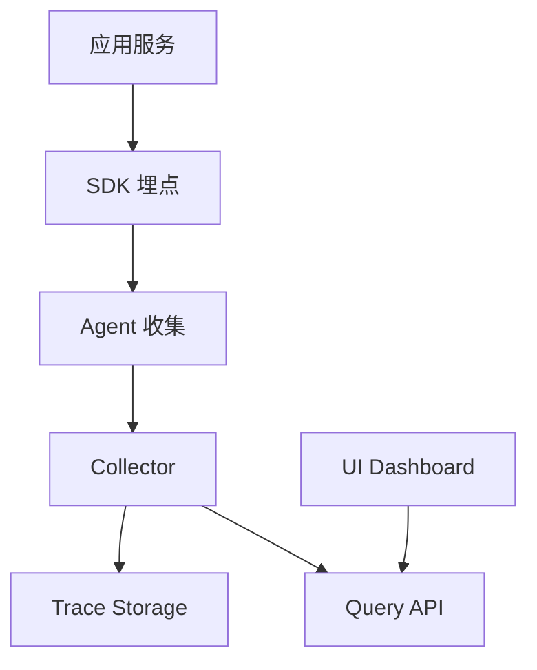

# RFC-[编号]: [方案标题]

> 一句话概括这个 RFC 要解决的问题或引入的变更。

## 📖 阅读指南

### 新手阅读路径
1. **第一步**：阅读 [摘要](#摘要)，快速了解方案要点
2. **第二步**：查看 [背景](#背景)，理解为什么要做这个改变
3. **第三步**：阅读 [详细设计](#详细设计)，理解具体实现方案
4. **第四步**：查看 [开放问题](#开放问题)，了解还需要讨论的内容

### 不同角色速查路径
- 架构师 → 直接看 [详细设计](#详细设计) 和 [可行性分析](#可行性分析)
- 开发工程师 → 直接看 [详细设计](#详细设计) 和 [实现计划](#实现计划)
- 产品经理 → 直接看 [背景](#背景) 和 [影响评估](#影响评估)
- 测试工程师 → 直接看 [测试策略](#测试策略) 和 [风险评估](#风险评估)

### AI 使用提示
> ⚠️ **给 AI 的说明**：使用本文档时，请注意以下要点：
> - 这是一个**讨论中的方案**，可能还不完整或有争议
> - 涉及实现细节时，以 [详细设计](#详细设计) 为准
> - 不要在 RFC 阶段就做最终实现决定
> - 评论和讨论应聚焦于**技术可行性**和**设计合理性**
> - 参考 [相关 RFC](#相关-rfc) 避免重复或冲突的设计

---

## 元信息

**简要说明：** 这里记录了这份技术方案的基本信息，比如编号、标题、作者和当前评审状态。

| 字段 | 内容 |
|------|------|
| RFC 编号 | RFC-001 |
| 标题 | 引入分布式追踪系统 |
| 作者 | @author |
| 创建日期 | 2026-04-27 |
| 当前状态 | 提议 / 评审中 / 已接受 / 已拒绝 / 已实现 |
| 评审截止 | 2026-05-05 |
| 目标版本 | v3.0 |

---

## 摘要

### 一段话概括

简要描述这个 RFC 的核心内容，包括：问题是什么、提议的解决方案、主要的权衡考虑。

### 关键词

- 分布式追踪
- 可观测性
- 性能监控

### 动机

为什么需要这个 RFC？解决什么问题？

---

## 背景

### 问题陈述

清晰、具体地描述当前面临的问题。

**当前状态**：
- 现状1
- 现状2
- 现状3

**期望状态**：
- 期望1
- 期望2
- 期望3

### 动机与目标

**简要说明：** 这里列出了这个技术方案要实现的目标，以及每个目标的重要程度。

| 目标 | 优先级 | 说明 |
|------|--------|------|
| 目标1 | P0 | 必须实现 |
| 目标2 | P0 | 必须实现 |
| 目标3 | P1 | 最好能实现 |

### 必须掌握的核心点 ⭐

**简要说明：** 这里总结了这个方案最关键的信息，看这几点就明白方案的核心内容。

| 要点 | 说明 |
|------|------|
| 核心问题 | 这个 RFC 要解决的最关键问题 |
| 提议方案 | 简要描述提议的解决方案 |
| 开放问题 | 还需要讨论和决策的问题 |
| 影响范围 | 这个变更会影响哪些系统 |

---

## 详细设计

### 架构设计



### 核心组件

#### 组件1：埋点 SDK

**职责**：无侵入式收集调用链数据

**接口设计**：

```typescript
interface TraceContext {
  traceId: string;
  spanId: string;
  parentId?: string;
  startTime: number;
  endTime?: number;
  tags: Record<string, string>;
}

interface Span {
  createChild(name: string): Span;
  setTag(key: string, value: string): void;
  finish(): void;
}
```

**配置**：

```yaml
tracing:
  enabled: true
  sampler:
    type: "rate"
    rate: 0.1  # 采样 10%
  exporter:
    type: "otlp"
    endpoint: "http://collector:4318"
```

#### 组件2：数据存储

**方案A：Jaeger（推荐）**
- 优点：轻量级、与 CNCF 生态兼容
- 缺点：不支持多租户

**方案B：Elasticsearch**
- 优点：功能强大、支持多租户
- 缺点：运维复杂、成本高

#### 组件3：查询 API

提供 gRPC 和 HTTP 两种接口：

```protobuf
service TraceService {
  rpc GetTrace(GetTraceRequest) returns (GetTraceResponse);
  rpc SearchTraces(SearchTracesRequest) returns (SearchTracesResponse);
}
```

### 数据模型

```typescript
interface Trace {
  traceId: string;
  serviceName: string;
  operationName: string;
  startTime: number;
  duration: number;
  spans: Span[];
  tags: Record<string, string>;
}

interface Span {
  spanId: string;
  parentSpanId?: string;
  operationName: string;
  startTime: number;
  duration: number;
  logs: Log[];
  tags: Record<string, string>;
}
```

---

## 可行性分析

### 技术可行性

**简要说明：** 这里评估了这个方案在技术上的可行性，包括复杂度、性能影响等方面。

| 方面 | 评估 | 说明 |
|------|------|------|
| 复杂度 | 中 | 需要改造现有 SDK |
| 性能影响 | 低 | 采样率控制，目标 < 3% CPU |
| 兼容性 | 高 | 支持现有主流框架 |
| 运维成本 | 中 | 需要部署新组件 |

### 资源需求

**简要说明：** 这里列出了实施这个方案需要的人力、服务器和存储等资源。

| 资源 | 需求 | 说明 |
|------|------|------|
| 开发人力 | 2 人月 | SDK 改造 + 服务端部署 |
| 服务器 | 4 核 8G x 3 | Collector + Storage |
| 存储 | 500GB/月 | 基于 10K QPS，保留 30 天 |

### 时间线

**简要说明：** 这里规划了实施这个方案的各个阶段和时间安排，以及每个阶段要交付什么。

| 阶段 | 预计时长 | 交付物 |
|------|----------|--------|
| 方案设计 | 1 周 | 详细设计文档 |
| SDK 开发 | 2 周 | 埋点 SDK |
| 服务端部署 | 1 周 | 追踪平台上线 |
| 试点接入 | 2 周 | 核心服务接入 |
| 全量推广 | 2 周 | 全量接入 |

---

## 影响评估

### 对现有系统的影响

**简要说明：** 这里分析了这个方案对现有系统的影响程度，看看会波及到哪些系统。

| 系统 | 影响 | 说明 |
|------|------|------|
| 应用服务 | 低 | 无侵入，只需配置 |
| 数据库 | 无 | 不影响 |
| 缓存 | 无 | 不影响 |

### 对性能的影响

**简要说明：** 这里评估了这个方案可能对系统性能造成的影响，以及如何降低这些影响。

| 指标 | 影响 | 缓解措施 |
|------|------|----------|
| CPU | +2~3% | 采样率控制 |
| 内存 | +50MB/实例 | - |
| 延迟 | +1~2ms | 异步发送 |

### 向后兼容性

✅ 本 RFC 不破坏向后兼容性

---

## 测试策略

### 单元测试

- SDK 核心逻辑测试
- 采样算法测试
- 数据序列化测试

### 集成测试

- 与 Collector 集成测试
- 与存储系统集成测试
- 端到端追踪测试

### 性能测试

- 高并发下的性能影响
- 采样准确性验证
- 存储写入吞吐量

---

## 实现计划

### 阶段1：基础设施（第1周）

- [ ] 部署 Collector
- [ ] 部署 Jaeger Storage
- [ ] 配置网络和安全策略

### 阶段2：SDK 开发（第2-3周）

- [ ] 实现埋点 SDK
- [ ] 实现采样器
- [ ] 实现 Exporter
- [ ] 编写单元测试

### 阶段3：试点接入（第4-5周）

- [ ] 选择 3-5 个核心服务试点
- [ ] 灰度接入
- [ ] 监控性能影响

### 阶段4：全量推广（第6-7周）

- [ ] 完善监控告警
- [ ] 编写使用文档
- [ ] 全量推广

---

## 风险评估

**简要说明：** 这里识别了实施这个方案可能遇到的风险，以及每种风险的应对策略。

| 风险 | 可能性 | 影响 | 缓解措施 |
|------|--------|------|----------|
| 性能影响超预期 | 中 | 中 | 降低采样率，准备回滚 |
| 存储成本超预期 | 低 | 高 | 先小规模验证存储需求 |
| 团队学习成本 | 高 | 低 | 提供培训和文档 |

---

## 开放问题

以下问题需要评审讨论：

**简要说明：** 这里列出了还需要团队讨论和决策的问题，以及推荐的解决方案。

| 问题 | 选项 | 推荐 | 状态 |
|------|------|------|------|
| 采样策略 | 固定比例 / 智能采样 / 全量 | 固定 10% | 待讨论 |
| 存储选型 | Jaeger / Elasticsearch | Jaeger | 待讨论 |
| 数据保留 | 7 天 / 30 天 / 90 天 | 30 天 | 待讨论 |
| 成本分摊 | 按服务 / 按团队 / 均摊 | 按服务 | 待讨论 |

---

## 相关 RFC

**简要说明：** 这里列出了与本方案相关的其他 RFC，方便了解依赖和关联关系。

| RFC | 关系 | 说明 |
|-----|------|------|
| RFC-023 | 依赖 | 日志系统升级，本 RFC 依赖此 RFC |
| RFC-045 | 相关 | 监控告警改进，可以结合 |

---

## 参考资料

**简要说明：** 这里提供了与这个方案相关的参考资料链接，方便深入了解技术细节。

| 资料 | 链接 |
|------|------|
| OpenTelemetry 官方文档 | [link](#) |
| Jaeger 官方文档 | [link](#) |
| 竞品实现参考 | [link](#) |

---

## 评论与讨论

> 请在评审期间在此处留下您的评论和讨论意见。

### @reviewer1

> 评论内容...

**回复**：

---

### @reviewer2

> 评论内容...

**回复**：

---

## 决策记录

**简要说明：** 这里记录了方案评审过程中的重要决策，以及决策的结果和负责人。

| 日期 | 决策 | 决策人 | 结果 |
|------|------|--------|------|
| 2026-05-05 | 评审会议 | @committee | 通过（有条件） |

---

## 变更日志

**简要说明：** 这里记录了这份方案的修改历史，方便知道什么时候更新了什么内容。

| 版本 | 日期 | 变更内容 | 作者 |
|------|------|----------|------|
| 1.0 | 2026-04-27 | 初始版本 | @author |
| 1.1 | 2026-05-01 | 根据评审意见更新 | @author |

---

## 许可证

[MIT License](LICENSE) - Copyright (c) 2026
